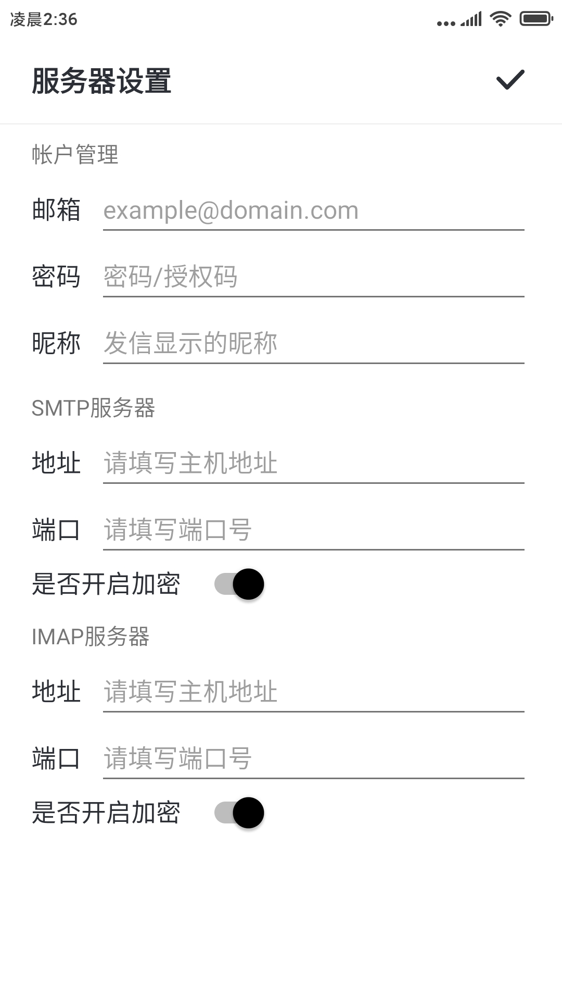
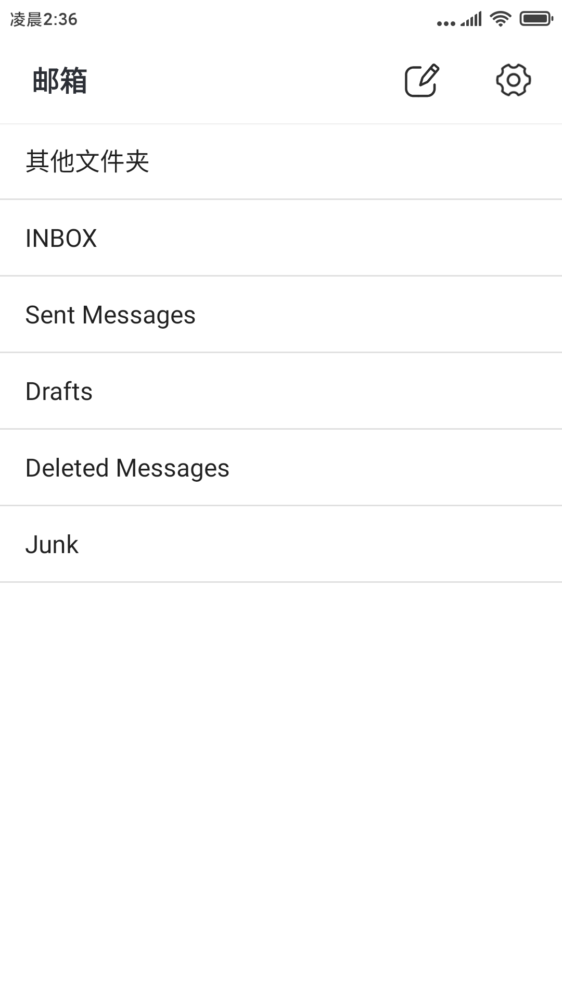
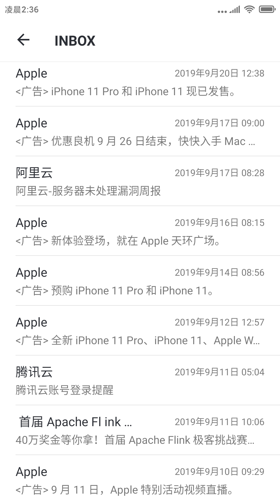
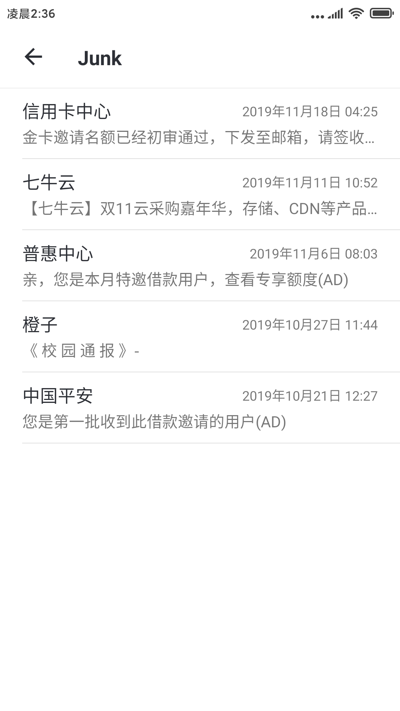

# EmailKit for Android
[](https://developer.android.google.cn/)
[](https://jitpack.io/#mailhu/email)
[](http://mail.qq.com/cgi-bin/qm_share?t=qm_mailme&email=Zx0AEgYJDxInAQgfCgYOC0kECAo)


EmailKit for Android是以JavaMail类库为基础进行封装的框架，它比JavaMail更简单易用，在使用它开发电子邮件客户端时，还能避免对电子邮件协议不熟悉的烦恼。目前EmailKit支持的电子邮件协议有SMTP和IMAP，它支持的功能有发送邮件，下载附件、获取文件夹列表、读取邮件、加载邮件、同步邮件，对邮件消息的移动，删除，保存到草稿箱等操作，同时支持邮箱的新邮件消息推送（需要邮件服务器支持相关命令），邮件搜索等功能。把它依赖到你的Android项目中，你只需简单配置邮件服务器的参数，再使用这些简易的接口，即可完成你所需的功能，所见即所得。

## 效果图
效果图中的示例程序是使用EmailKit框架编写的邮箱客户端，示例程序的源码在本项目的app模块中。因时间原因，所以我只完成示例程序中的邮件服务器配置、发送邮件、加载邮件、同步邮件、查看邮件、下载附件这些基础功能，希望体谅。

|                           |                          |                          |
|:-------------------------:|:------------------------:|:------------------------:|
| 服务器设置                 | 邮箱文件夹列表            | 写邮件                    |
| |  |  |
| 收件箱列表                 | 垃圾箱列表                | 查看邮件内容              |
|  |  | |
|                           |                          |                          |

## 文档链接
+ EmailKit最新文档，请到Wiki里**仔细耐心地**查阅 [最新文档](https://github.com/mailhu/emailkit/wiki)
+ 若你对该框架有什么疑问或提issues前可以先查看一下 [FAQ](https://github.com/mailhu/emailkit/blob/master/doc/FAQ.md)
+ 4.x版本代码和文档改动较大，需要查阅3.x文档请点击 [这里](https://github.com/mailhu/emailkit/blob/master/doc/3.x.md)
+ 2.x版本的文档已没太大意义，仅做考古使用，点击进入 [考古](https://github.com/mailhu/emailkit/blob/master/doc/2.x.md)
+ 你想了解这个框架的历史，可以查看 [更新日志](https://github.com/mailhu/emailkit/blob/master/doc/log.md)

## 安装引入
步骤一、将JitPack存储库添加到根目录的build.gradle中：
```gradle
allprojects {
    repositories {
        ...
        maven { url 'https://jitpack.io' }
    }
}
```
步骤二、在项目的app模块下的build.gradle里加：
```gradle
dependencies {
    implementation 'com.github.mailhu:emailkit:4.2.1'
}
```
注：因为该库内部使用了Java 8新特性，可能你的项目依赖该框架在构建时出现如下错误：
```
Invoke-customs are only supported starting with Android O (--min-api 26)
```
你可以在项目的app模块下的build.gradle里加添如下代码：
```gradle
android {
    ...
    compileOptions {
        sourceCompatibility JavaVersion.VERSION_1_8
        targetCompatibility JavaVersion.VERSION_1_8
    }
}
```

## 简单示例
以下代码是展示如何发送一封简单的电子邮件。若想了解框架的更多功能，请查阅Wiki文档。
```java
//初始化框架
EmailKit.initialize(this);

//配置发件人邮件服务器参数
EmailKit.Config config = new EmailKit.Config()
        .setMailType(EmailKit.MailType.FOXMAIL)     //选择邮箱类型，快速配置服务器参数
        .setAccount("from@foxmail.com")             //发件人邮箱
        .setPassword("password");                   //密码或授权码

//设置一封草稿邮件
Draft draft = new Draft()
        .setNickname("小学生")                      //发件人昵称
        .setTo("to@qq.com")                        //收件人邮箱
        .setSubject("这是一封测试邮件")             //邮件主题
        .setText("Hello world !");                 //邮件正文

//使用SMTP服务发送邮件
EmailKit.useSMTPService(config)
        .send(draft, new EmailKit.GetSendCallback() {
            @Override
            public void onSuccess() {
                Log.i(TAG, "发送成功！");
            }

            @Override
            public void onFailure(String errMsg) {
                Log.i(TAG, "发送失败，错误：" + errMsg);
            }
        });
```

## 混淆
```
-dontwarn com.sun.**
-dontwarn javax.mail.**
-dontwarn javax.activation.**
-keep class com.sun.** { *;}
-keep class javax.mail.** { *;}
-keep class javax.activation.** { *;}
-keep class com.smailnet.emailkit.** { *;}
```

## 致谢
示例程序中所用到的开源库、框架和图像资源，在此致谢!
+ [LitePal](https://github.com/LitePalFramework/LitePal)
+ [MicroKV](https://github.com/mailhu/microkv)
+ [SmartRefreshLayout](https://github.com/scwang90/SmartRefreshLayout)
+ [BaseRecyclerViewAdapterHelper](https://github.com/CymChad/BaseRecyclerViewAdapterHelper)
+ [Iconfont](https://www.iconfont.cn/)

## 作者留言
目前作者是靠课余时间来开发和维护这个框架，如果有什么需求和问题可以提issues或通过邮件联系我。因学业繁忙和能力有限，大家提的需求和问题不一定很快解决和给出答复，希望大家体谅和包涵。

E-mail：zguanhu@foxmail.com

## License
```
Copyright 2018 张观湖

Licensed under the Apache License, Version 2.0 (the "License");
you may not use this file except in compliance with the License.
You may obtain a copy of the License at

   http://www.apache.org/licenses/LICENSE-2.0

Unless required by applicable law or agreed to in writing, software
distributed under the License is distributed on an "AS IS" BASIS,
WITHOUT WARRANTIES OR CONDITIONS OF ANY KIND, either express or implied.
See the License for the specific language governing permissions and
limitations under the License.
```