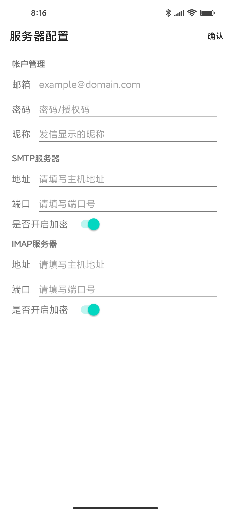
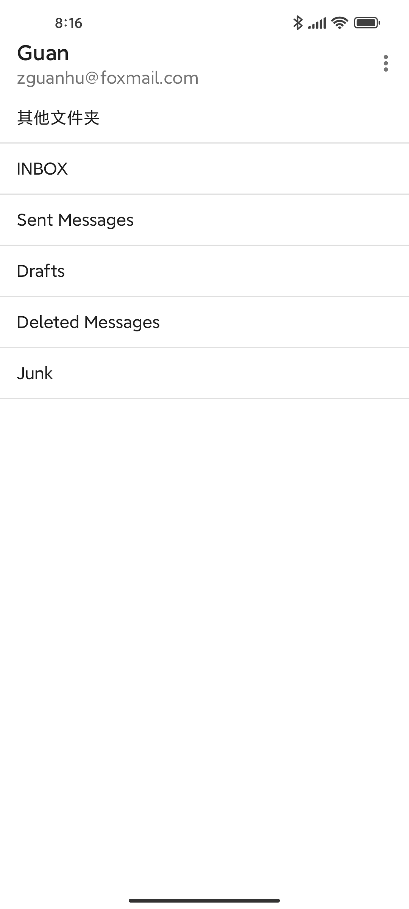
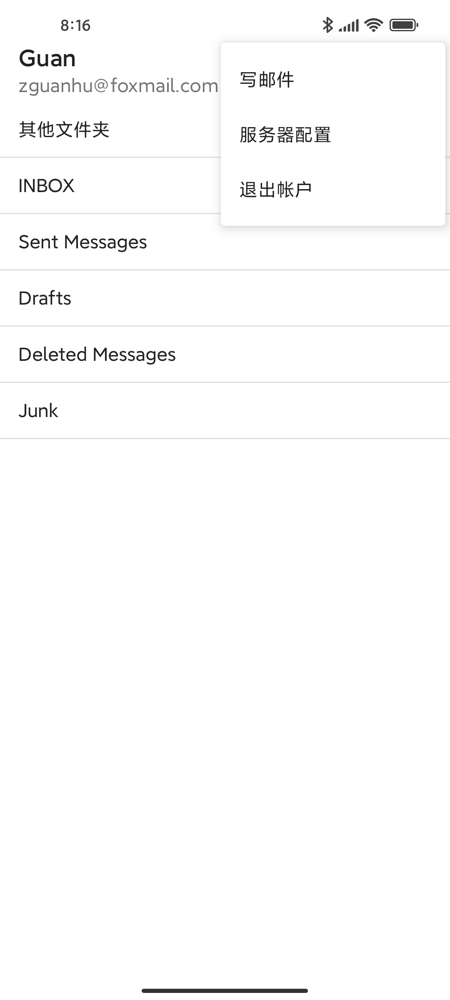
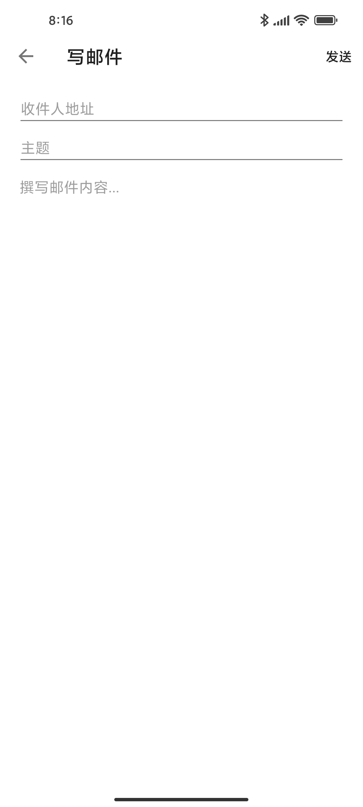
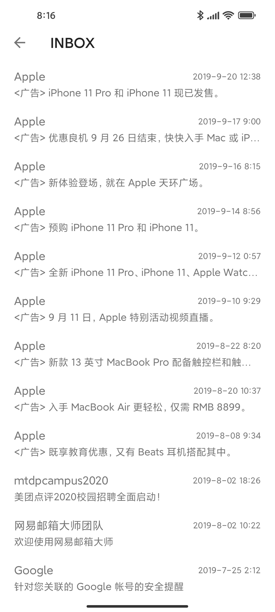
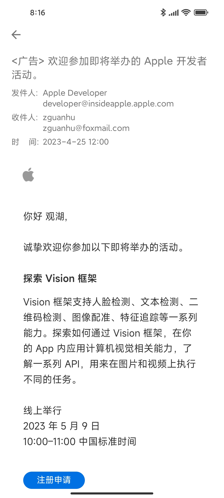

# Android-Mail

Android-Mail 是基于 JavaMail 库设计与开发的邮箱 App 。2022年12月完成本项目的代码重构后，不再独立提供封装 JavaMail 的库，而是以整个 App 项目的形式来开源代码。
本项目工程包含两部分，分别是``app``模块和``mailkit``模块。app 模块含有邮箱客户端的界面和操作逻辑等代码；mailkit 模块主要封装了 JavaMail ，以 API 的形式
提供给 app 模块调用。Android-Mail 客户端目前支持的功能有：配置邮件服务器、发送简单邮件、获取文件夹列表、同步邮件、加载邮件、读取邮件。
README 会列出 mailkit API 供大家查阅和参考，带有“ * ”的标题表示该 API 未被 app 模块使用。
因 JavaMail 内容博大精深，作者的水平和时间有限，所以计划本项目不长期维护，请大家见谅。

2023年4月，Android-Mail 原先使用的 SQLite 数据库（LitePal ORM）被替换为 QuickIO 数据库。[QuickIO](https://github.com/artbits/quickio) 是作者自研的高性能嵌入式 NoSQL 数据库，现以作为试验，引入到 Android-Mail 项目中使用。

## 效果图

|                           |                          |                          |
|:-------------------------:|:------------------------:|:------------------------:|
| 服务器设置                 | 邮箱文件夹列表            | 菜单弹窗                  |
| |  |  |
| 写邮件                     | 收件箱列表                | 查看邮件内容              |
|  |  | |
|                           |                          |                          |

## MailKit API

**配置邮件服务器**
```java 
MailKit.Config config = new MailKit.Config(c -> {
    c.account = "user@foxmail.com";
    c.password = "password";
    c.nickname = "Li Hua";
    c.SMTPHost = "smtp.qq.com";
    c.SMTPPort = 465;
    c.SMTPSSLEnable = true;
    c.IMAPHost = "imap.qq.com";
    c.IMAPPort = 993;
    c.IMAPSSLEnable = true;
});
```

**验证邮件服务器配置**
```java
MailKit.auth(config, () -> {
    //验证成功，执行后续操作
}, e -> {
    //验证失败
    Log.d(TAG, e.getMessage());
});
```

**发送邮件**
```java
MailKit.Draft draft = new MailKit.Draft(d -> {
    d.to = new String[]{"to@foxmail.com"};
    d.subject = "Android-Mail Test";
    d.text = "Hello world";
    //d.cc = new String[]{"..."};   抄送人地址
    //d.bcc = new String[]{"..."};  密送人地址
    //d.html = "..."                发送富文本邮件内容
});

MailKit.SMTP smtp = new MailKit.SMTP(config);
smtp.send(draft, () -> {
    //发送成功，执行后续操作
}, e -> {
    //发送失败
    Log.d(TAG, e.getMessage());
});
```

**获取文件夹列表**
```java
MailKit.IMAP imap = new MailKit.IMAP(config);
imap.getDefaultFolders(strings -> {
    //获取成功，打印列表的文件夹名称
    strings.forEach(s -> Log.d(TAG, s));
}, e -> {
    //获取失败
    Log.d(TAG, e.getMessage());
});
```

**获取指定的文件夹**
```java
MailKit.IMAP imap = new MailKit.IMAP(config);
//获取指定名称的文件夹
MailKit.IMAP.Folder folder = imap.getFolder("INBOX");
//获取收件箱文件夹
MailKit.IMAP.Inbox inbox = imap.getInbox();
//获取草稿箱文件夹
MailKit.IMAP.DraftBox draftBox = imap.getDraftBox();
```

**加载文件夹中的邮件头列表**

邮箱中文件夹中存在多封邮件，用load方法加载缓存到App本地，使用说明：
+ 若本地还没缓存过邮件消息时，minUID值传入一个小于0的值，例如-1，它将加载最新的20封邮件。
+ 若本地客已缓存过邮件消息时，则给minUID传入本地缓存的全部邮件中UID最小的那个值，它将加载比minUID值更小的20封邮件。
+ 每次加载的邮件的数量在[0, 20]之间。
```java
MailKit.IMAP imap = new MailKit.IMAP(config);
MailKit.IMAP.Folder folder = imap.getFolder("INBOX");
folder.load(-1, msgList -> {
    //加载成功，执行后续操作
    msgList.forEach(msg -> {
        Log.d(TAG, String.valueOf(msg.uid));
        Log.d(TAG, String.valueOf(msg.sentDate));
        Log.d(TAG, String.valueOf(msg.flags.isSeen));
        Log.d(TAG, String.valueOf(msg.flags.isStar));
        Log.d(TAG, msg.subject);
        Log.d(TAG, msg.from.address);
        Log.d(TAG, msg.from.nickname);
        msg.toList.forEach(to -> {
            Log.d(TAG, to.address);
            Log.d(TAG, to.nickname);
        });
        msg.ccList.forEach(cc -> {
            Log.d(TAG, cc.address);
            Log.d(TAG, cc.nickname);
        });
        //Log.d(TAG, String.valueOf(msg.mainBody == null)); load方法不加载邮件正文内容
    });  
}, e -> {
    //加载失败
    Log.d(TAG, e.getMessage());
});
```

**同步文件夹中的邮件头**

本地每隔一段时间就应该与邮件服务器进行一次邮件同步，同步主要是查询邮件服务器是否有新邮件和本地已缓存过的邮件在服务器中是否有被删除，使用说明：
+ 参数localUIDArray为本地客户端已缓存的全部邮件UID。
+ 若发现服务端有邮件的UID比数组localUIDArray中的最大UID还要大，则拉取该邮件消息（新邮件）。
+ 若发现数组localUIDArray中的某一个UID值在服务端中不存在，则返回该UID。
+ 假设服务端[6, 5, 4, 2, 1]，客户端[4, 3, 2]，同步该服务端结果：新消息[6, 5]，已删除[3]。
```java
//本地已缓存邮件消息的uid
long[] localUIDArray = new long[]{1, 2, 3, 4, 5, 6};
//如果本地还没有缓存过邮件，传入一个空数组既不同步邮件，也不拉取邮件
//long[] longs = new long[0];

MailKit.IMAP imap = new MailKit.IMAP(config);
MailKit.IMAP.Folder folder = imap.getFolder("INBOX");
folder.sync(localUIDArray, (msgList, longs) -> {
    //同步成功，执行后续操作
    //获取新邮件
    msgList.forEach(msg -> {
        Log.d(TAG, String.valueOf(msg.uid));
        Log.d(TAG, String.valueOf(msg.sentDate));
        Log.d(TAG, String.valueOf(msg.flags.isSeen));
        Log.d(TAG, String.valueOf(msg.flags.isStar));
        Log.d(TAG, msg.subject);
        Log.d(TAG, msg.from.address);
        Log.d(TAG, msg.from.nickname);
        msg.toList.forEach(to -> {
            Log.d(TAG, to.address);
            Log.d(TAG, to.nickname);
        });
        msg.ccList.forEach(cc -> {
            Log.d(TAG, cc.address);
            Log.d(TAG, cc.nickname);
        });
        //Log.d(TAG, String.valueOf(msg.mainBody == null)); sync方法不加载邮件正文内容
    });
    //本地需要删除的邮件UID
    longs.forEach(uid -> Log.i(TAG, String.valueOf(uid)));
}, e -> {
    //同步失败
    Log.d(TAG, e.getMessage());
});
```

**通过网络读取邮件详情**
```java
MailKit.IMAP imap = new MailKit.IMAP(config);
MailKit.IMAP.Folder folder = imap.getFolder("INBOX");

//假设UID = 1967；不支持获取文件内容的附件
folder.getMsg(1967, msg -> {
    //读取成功，执行后续操作
    Log.d(TAG, String.valueOf(msg.uid));
    Log.d(TAG, String.valueOf(msg.sentDate));
    Log.d(TAG, String.valueOf(msg.flags.isSeen));
    Log.d(TAG, String.valueOf(msg.flags.isStar));
    Log.d(TAG, msg.subject);
    Log.d(TAG, msg.from.address);
    Log.d(TAG, msg.from.nickname);
    msg.toList.forEach(to -> {
        Log.d(TAG, to.address);
        Log.d(TAG, to.nickname);
    });
    msg.ccList.forEach(cc -> {
        Log.d(TAG, cc.address);
        Log.d(TAG, cc.nickname);
    });
    Log.d(TAG, msg.mainBody.type);
    Log.d(TAG, msg.mainBody.content); 
}, e -> {
    //读取失败
    Log.d(TAG, e.getMessage());
});
```

**\* 标记或移除邮件的star**
```java
MailKit.IMAP imap = new MailKit.IMAP(config);
MailKit.IMAP.Inbox inbox = imap.getInbox();

//传入需要标记或移除star的邮件UID数组，需要star则为true，否则为false
inbox.star(new long[]{1967}, true, () -> {
    //操作完成，执行后续操作
}, e -> {
    //操作失败
    Log.d(TAG, e.getMessage());
});
```

**\* 标记邮件状态是否已读**
```java
MailKit.IMAP imap = new MailKit.IMAP(config);
MailKit.IMAP.Inbox inbox = imap.getInbox();

//传入需要标记邮件UID数组，标记已读则为true，否则为false
inbox.readStatus(new long[]{1967}, false, () -> {
    //操作完成，执行后续操作
}, e -> {
    //操作失败
    Log.d(TAG, e.getMessage());
});
```

**\* 移动邮件到另一文件夹**
```java
MailKit.IMAP imap = new MailKit.IMAP(config);
MailKit.IMAP.Inbox inbox = imap.getInbox();

//设置需要把邮件移动到的文件夹名称，传入邮件UID数组
inbox.move("Deleted Messages", new long[]{1876}, () -> {
    //操作完成，执行后续操作
}, e -> {
    //操作失败
    Log.d(TAG, e.getMessage());
});
```

**\* 彻底删除文件夹中的邮件**
```java
MailKit.IMAP imap = new MailKit.IMAP(config);
MailKit.IMAP.Inbox inbox = imap.getInbox();

//传入需要彻底删除的邮件UID数组
inbox.delete(new long[]{1966}, () -> {
    //操作完成，执行后续操作
}, e -> {
    //操作失败
    Log.d(TAG, e.getMessage());
});
```

**\* 统计文件夹中的全部邮件数量和未读邮件的数量**
```java
MailKit.IMAP imap = new MailKit.IMAP(config);
MailKit.IMAP.Inbox inbox = imap.getInbox();

//统计文件夹中的全部邮件数量和未读邮件的数量
inbox.count((total, unread) -> {
    //操作完成，执行后续操作
}, e -> {
    //操作失败
    Log.d(TAG, e.getMessage());
});
```

**\* 把草稿保存到草稿箱**
```java
MailKit.Draft draft = new MailKit.Draft(d -> {
    d.to = new String[]{"to@outlook.com"};
    d.subject = "MailKit test";
    d.text = "Hello world";
});

MailKit.IMAP imap = new MailKit.IMAP(config);
MailKit.IMAP.DraftBox draftBox = imap.getDraftBox();
draftBox.save(draft, () -> {
    //保存成功，执行后续操作
}, e -> {
    //保存失败
    Log.d(TAG, e.getMessage());
});
```

**\* 按邮件主题搜索邮件内容（部分邮件服务器供应商不支持）**
```java
MailKit.IMAP imap = new MailKit.IMAP(config);
MailKit.IMAP.Inbox inbox = imap.getInbox();

String subject = "需要搜索的邮件主题";
inbox.searchBySubject(subject, msgList -> {
    //搜索成功，执行后续操作
    msgList.forEach(msg -> {
        Log.d(TAG, String.valueOf(msg.uid));
        Log.d(TAG, String.valueOf(msg.sentDate));
        Log.d(TAG, String.valueOf(msg.flags.isSeen));
        Log.d(TAG, String.valueOf(msg.flags.isStar));
        Log.d(TAG, msg.subject);
        Log.d(TAG, msg.from.address);
        Log.d(TAG, msg.from.nickname);
        msg.toList.forEach(to -> {
            Log.d(TAG, to.address);
            Log.d(TAG, to.nickname);
        });
        msg.ccList.forEach(cc -> {
            Log.d(TAG, cc.address);
            Log.d(TAG, cc.nickname);
        });
        //Log.d(TAG, String.valueOf(msg.mainBody == null)); 不支持获取邮件正文内容
    });
}, e -> {
    //搜索失败
    Log.d(TAG, e.getMessage());
});
```

**\* 按发件人昵称搜索邮件内容（部分邮件服务器供应商不支持）**
```java
MailKit.IMAP imap = new MailKit.IMAP(config);
MailKit.IMAP.Inbox inbox = imap.getInbox();

String nickname = "Lisa";
inbox.searchByFrom(nickname, msgList -> {
    //搜索成功，执行后续操作
}, e -> {
    //搜索失败
    Log.d(TAG, e.getMessage());
});
```

**\* 按收件人昵称搜索邮件内容（部分邮件服务器供应商不支持）**
```java
MailKit.IMAP imap = new MailKit.IMAP(config);
MailKit.IMAP.Inbox inbox = imap.getInbox();

String nickname = "Li Hua";
inbox.searchByTo(nickname, msgList -> {
    //搜索成功，执行后续操作
}, e -> {
    //搜索失败
    Log.d(TAG, e.getMessage());
});
```

## App中用到的开源项目
+ [QuickIO](https://github.com/artbits/quickio)
+ [SmartRefreshLayout](https://github.com/scwang90/SmartRefreshLayout)
+ [BaseRecyclerViewAdapterHelper](https://github.com/CymChad/BaseRecyclerViewAdapterHelper)


## License
```
Copyright 2018 Zhang Guanhu

Licensed under the Apache License, Version 2.0 (the "License");
you may not use this file except in compliance with the License.
You may obtain a copy of the License at

   http://www.apache.org/licenses/LICENSE-2.0

Unless required by applicable law or agreed to in writing, software
distributed under the License is distributed on an "AS IS" BASIS,
WITHOUT WARRANTIES OR CONDITIONS OF ANY KIND, either express or implied.
See the License for the specific language governing permissions and
limitations under the License.
```